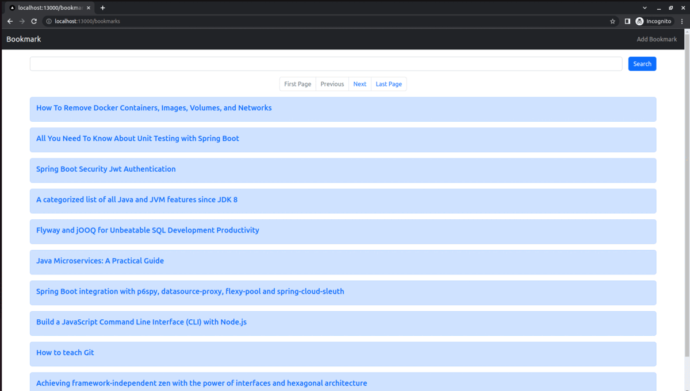

# Bookmarker webapp using spring with Kubernetes

> **NOTE:**
> The code in the `main` branch is updated to use the latest versions of the dependencies.

The application functionality is: 
   * Show bookmarks (max 10 per page)
   * Support adding a new bookmark with title and url
   * Search / Filter bookmarks based on title of the bookmark
   * Support basic pagination: jump to previous page, next page, first page and last page of bookmarks


### Screenshot


### Technologies

The code has following modules: <br/>

<b>bookmarker-api</b>:
   * [Spring-Boot](https://docs.spring.io/spring-boot/docs/current/reference/htmlsingle/)
   * [Spring-Data-Jpa: makes database access and pagination easier](https://spring.io/projects/spring-data-jpa)
   * [Flyway: for db migrations](https://documentation.red-gate.com/fd/why-database-migrations-184127574.html)
   * [testcontainers: carry out integration testing with external services using containers ](https://java.testcontainers.org/)
   * [jib-maven-plugin: to dockerize the spring boot app without writing dockerfile](https://github.com/GoogleContainerTools/jib/tree/master/jib-maven-plugin)
   * [Postgresql](https://www.postgresql.org/) 
<br/>

<b>bookmarker-ui-nextjs</b>: 
   * [ReactJs](https://react.dev/) with [NextJs](https://nextjs.org/),
   * [Bootstrap](https://getbootstrap.com/)
<br/>

for <em>deployment</em>: 
   * [GitHub Actions for CI/CD - build docker images and push to dockerhub](https://docs.github.com/en/actions/learn-github-actions/understanding-github-actions): checkout [bookmarker-app/.github/worflows/build.yml](https://github.com/gau-rao/bookmarker-app/blob/master/.github/workflows/build.yml)
   * [docker-compose (for local development)](https://docs.docker.com/compose/)
   * [kind (for creating a local k8s cluster and deploying in it)](https://kind.sigs.k8s.io/) and
   * [lens (for inspecting k8s cluster)](https://k8slens.dev/desktop.html)<br/>


## How to run?

```shell
$ git clone https://github.com/gau-rao/Bookmarker.git
$ cd Bookmarker
$ ./run.sh start
$ ./run.sh stop

$ ./run.sh start_infra
$ ./run.sh stop_infra
```

* To start only dependent services

```shell
$ ./run.sh start_infra
$ ./run.sh stop_infra
```

## Running on Kubernetes

```shell
$ cd Bookmarker
$ cd kind
$ ./create-cluster.sh
$ cd ../
$ kubectl apply -f k8s/
```

* Access API using NodePort http://localhost:18080/api/bookmarks
* Access UI using NodePort http://localhost:30080/
* Access API using Ingress http://localhost/bookmarker-api/api/bookmarks 

## Kubernetes Useful commands

### Pods

```shell
kubectl get pods
kubectl get all
kubectl run bookmarker-api --image=gau-rao/bookmarker-api --restart=Never --port=8080 --labels=env=dev,version=1.0
kubectl get all
kubectl describe pods bookmarker-api
kubectl delete pods bookmarker-api

kubectl run bookmarker-api --image=gau-rao/bookmarker-api --restart=Never --port=8080 --labels=env=dev,version=1.0 --dry-run=client -o yaml > pod.yaml
kubectl apply -f pod.yaml
kubectl logs bookmarker-api -f
kubectl exec -it bookmarker-api -- /bin/sh
kubectl delete -f pod.yaml

kubectl get ns
kubectl create ns dev
kubectl run bookmarker-api --image=gau-rao/bookmarker-api --restart=Never --port=8080 -n dev -o yaml --dry-run=client > pod.yaml

kubectl get pods -n dev
kubectl delete ns dev
```

### Deployments

```shell
kubectl create deployment bookmarker-api-deploy --image=gau-rao/bookmarker-api
kubectl create deployment bookmarker-api-deploy --image=gau-rao/bookmarker-api --dry-run=client -o yaml > deployment.yaml
kubectl describe deployments.apps/bookmarker-api-deploy
kubectl rollout history deployments bookmarker-api-deploy
kubectl scale deployment bookmarker-api-deploy --replicas=3

kubectl set image deployment bookmarker-api-deploy bookmarker-api=gau-rao/bookmarker-api:1.1
kubectl rollout status deployment bookmarker-api-deploy

kubectl rollout undo deployment bookmarker-api-deploy --to-revision=1
```

### ConfigMaps & Secrets

```shell
kubectl create configmap db-config --from-literal=db_host=postgres --from-literal=db_name=appdb
kubectl create configmap db-config --from-env-file=config.env
kubectl create configmap db-config --from-file=config.txt
kubectl create configmap db-config --from-file=app-config
kubectl describe configmaps db-config
kubectl get configmaps db-config -o yaml

kubectl create secret generic db-creds --from-literal=pwd=s3cret
kubectl create secret generic db-creds --from-env-file=secret.env
kubectl create secret generic ssh-key --from-file=id_rsa=~/.ssh/id_rsa
echo -n 's3cret!' | base64
kubectl get secret db-creds
```

### Services

* **ClusterIP**:  Exposes the Service on a cluster-internal IP. Only reachable from within the cluster.
* **NodePort**: Exposes the Service on each node's IP address at a static port. Accessible from outside of the cluster.
* **LoadBalancer**: Exposes the Service externally using a cloud provider's load balancer.
* **ExternalName**: Maps a Service to a DNS name.

```shell
kubectl expose deployment bookmarker-api-deploy --port=8080 --target-port=8080 --type=NodePort
```
